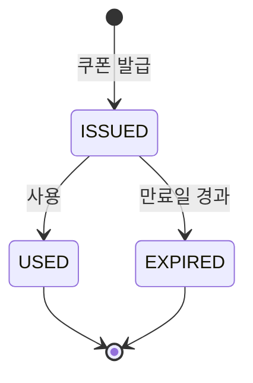
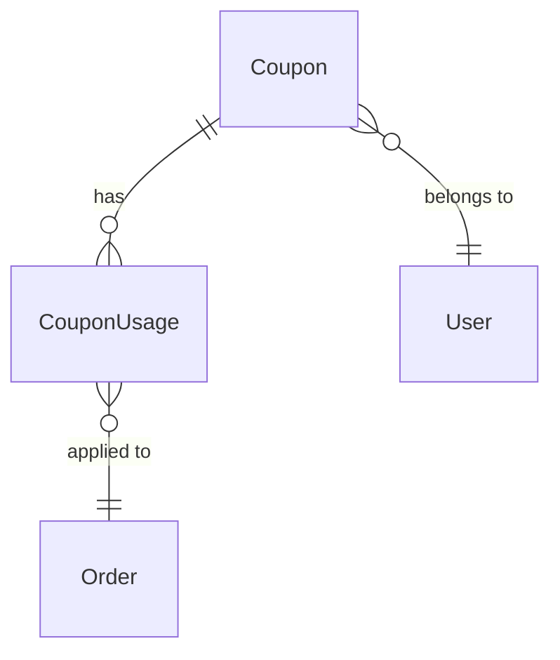
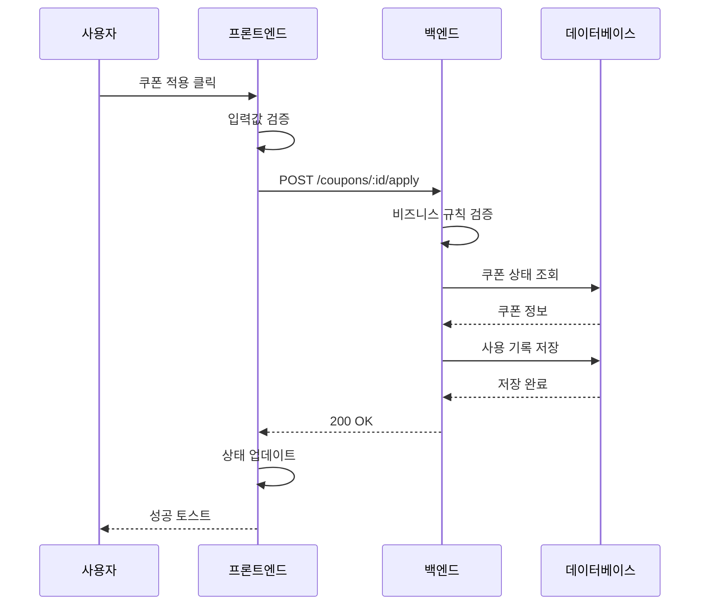
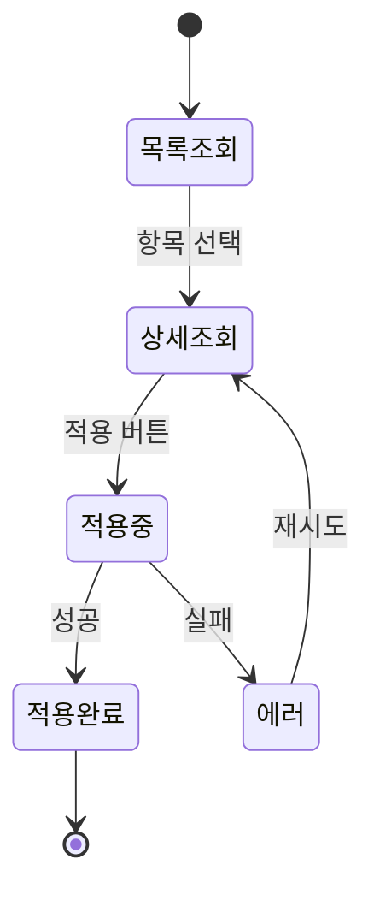
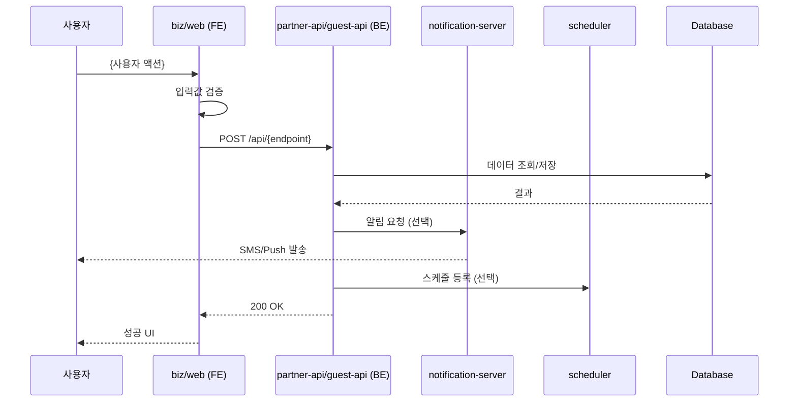
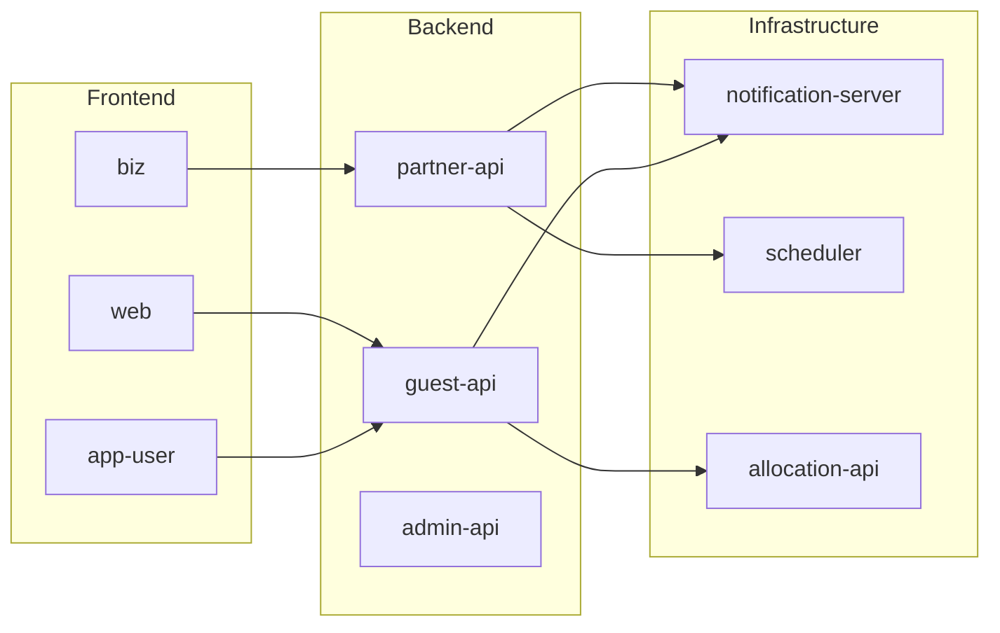

# 문서 템플릿

각 문서 유형별 템플릿. 복사하여 사용.

---

## domains/{domain}/README.md (도메인 공통 개요)

```markdown
---
domain: {domain-name}
version: 1.0.0
last_updated: {YYYY-MM-DD}
status: draft
implemented_in:
  - guest-api
  - partner-api
  - web
  - biz
---

# {Domain Name} 도메인

## 개요

{도메인의 목적과 역할을 1-2문장으로 설명}

## 구현 프로젝트

| 프로젝트 | 역할 | 문서 |
|---------|------|------|
| guest-api | {역할} | [API 명세](./guest-api/api-spec.md) |
| partner-api | {역할} | [API 명세](./partner-api/api-spec.md) |
| web | {역할} | [컴포넌트](./web/components.md) |
| biz | {역할} | [컴포넌트](./biz/components.md) |

## 공통 문서

- [데이터 모델](./data-model.md) - 공통 Entity, DB 스키마
- [크로스-프로젝트 분석](./cross-project.md) - 프로젝트 간 비교/흐름도

## 프로젝트별 문서

### 백엔드
- guest-api: [API](./guest-api/api-spec.md) | [규칙](./guest-api/business-rules.md) | [흐름](./guest-api/data-flow.md)
- partner-api: [API](./partner-api/api-spec.md) | [규칙](./partner-api/business-rules.md) | [흐름](./partner-api/data-flow.md)

### 프론트엔드
- web: [컴포넌트](./web/components.md) | [흐름](./web/data-flow.md)
- biz: [컴포넌트](./biz/components.md)

## 연관 도메인

| 도메인 | 관계 | 설명 |
|--------|------|------|
| [{연관도메인}](../{domain}/README.md) | 의존 | {관계 설명} |

## 비개발자용 문서

- [기능 개요](../../business/{domain}/overview.md)
- [자주 묻는 질문](../../business/{domain}/faq.md)
- [정책](../../business/{domain}/policies.md)

## 변경 이력

| 버전 | 날짜 | 변경 내용 |
|------|------|----------|
| 1.0.0 | {date} | 최초 생성 |
```

---

## domains/{domain}/{project}/api-spec.md (프로젝트별 API 명세)

```markdown
---
domain: {domain-name}
project: {project-name}
version: 1.0.0
last_updated: {YYYY-MM-DD}
status: draft
source_project: lane4-{project-name}
watch_paths:
  - lane4-{project-name}/src/domains/{domain}/**/*.controller.ts
---

# {Domain Name} API 명세 - {project-name}

> 다른 프로젝트 API: [guest-api](../guest-api/api-spec.md) | [partner-api](../partner-api/api-spec.md)

## 엔드포인트 목록

| 메서드 | 경로 | 설명 | 인증 |
|--------|------|------|------|
| GET | /api/{domain} | 목록 조회 | ✓ |
| POST | /api/{domain} | 생성 | ✓ |

---

## GET /api/{domain}

### Request

| 파라미터 | 타입 | 필수 | 설명 |
|----------|------|------|------|
| {param} | {type} | {Y/N} | {설명} |

### Response

**200 OK**

```json
{
  // 실제 응답 구조
}
```

### 코드 위치

- **Controller**: `src/domains/{domain}/{domain}.controller.ts:L{line}`
- **Service**: `src/domains/{domain}/{domain}.service.ts:L{line}`

---

## 변경 이력

| 버전 | 날짜 | 변경 내용 | 관련 코드 |
|------|------|----------|----------|
| 1.0.0 | {date} | 최초 생성 | - |
```

---

## domains/{domain}/{project}/business-rules.md (프로젝트별 비즈니스 규칙)

```markdown
---
domain: {domain-name}
project: {project-name}
version: 1.0.0
last_updated: {YYYY-MM-DD}
status: draft
source_project: lane4-{project-name}
---

# {Domain Name} 비즈니스 규칙 - {project-name}

> 다른 프로젝트: [guest-api](../guest-api/business-rules.md) | [partner-api](../partner-api/business-rules.md)

## 핵심 규칙

### 1. {규칙 제목}

- **규칙**: {규칙 설명}
- **조건**: {조건}
- **결과**: {결과}
- **코드 위치**: `src/domains/{domain}/{file}.ts:L{line}`

```typescript
// 실제 코드 발췌
```

## 정책값

| 항목 | 값 | 설명 | 코드 위치 |
|------|------|------|----------|
| {항목} | {값} | {설명} | `{file}:L{line}` |

## 이 프로젝트 전용 규칙

> guest-api/partner-api 간 차이점

| 규칙 | 이 프로젝트 | 다른 프로젝트 | 비고 |
|------|------------|--------------|------|
| {규칙} | {적용 방식} | {다른 방식} | {비고} |

## 변경 이력

| 버전 | 날짜 | 변경 내용 | 관련 코드 |
|------|------|----------|----------|
| 1.0.0 | {date} | 최초 생성 | - |
```

---

## domains/{domain}/{project}/components.md (프론트엔드 컴포넌트)

```markdown
---
domain: {domain-name}
project: {project-name}
version: 1.0.0
last_updated: {YYYY-MM-DD}
status: draft
source_project: lane4-{project-name}
---

# {Domain Name} 컴포넌트 - {project-name}

> 다른 프로젝트: [web](../web/components.md) | [biz](../biz/components.md)

## 주요 컴포넌트

| 컴포넌트 | 설명 | 위치 |
|---------|------|------|
| {ComponentName} | {설명} | `src/components/{path}` |

## 페이지

| 페이지 | 경로 | 설명 | 위치 |
|--------|------|------|------|
| {PageName} | /{route} | {설명} | `pages/{path}` |

## API 호출

| 기능 | 엔드포인트 | Hook/Service | 위치 |
|------|-----------|--------------|------|
| {기능} | {endpoint} | {hookName} | `{path}` |

## 상태 관리

| 상태 | 타입 | 관리 방식 | 위치 |
|------|------|----------|------|
| {state} | {type} | Context/Redux/Query | `{path}` |

## 이 프로젝트 전용 기능

| 기능 | 설명 | 코드 위치 |
|------|------|----------|
| {기능} | {설명} | `{path}:L{line}` |

## 변경 이력

| 버전 | 날짜 | 변경 내용 |
|------|------|----------|
| 1.0.0 | {date} | 최초 생성 |
```

---

## domains/{domain}/business-rules.md

```markdown
---
domain: {domain-name}
version: 1.0.0
last_updated: {YYYY-MM-DD}
status: draft
---

# {Domain Name} 비즈니스 규칙

## 핵심 규칙

### 1. {규칙 제목}

- **규칙**: {규칙 설명}
- **조건**: {조건}
- **결과**: {결과}
- **코드 위치**: `{file-path}:{line-number}`

```typescript
// 코드 발췌
if (condition) {
  // 규칙 적용
}
```

### 2. {규칙 제목}

...

## 정책값

| 항목 | 값 | 설명 | 코드 위치 |
|------|------|------|----------|
| 최대 적용 개수 | 3 | 한 주문당 최대 쿠폰 적용 수 | `service.ts:L45` |
| 최소 주문 금액 | 10,000원 | 쿠폰 사용 최소 금액 | `entity.ts:L12` |

## 상태 흐름



## 프론트엔드 추가 규칙

> 백엔드에 없고 프론트엔드에서만 적용되는 규칙

| 규칙 | 설명 | 위치 | 비고 |
|------|------|------|------|
| {규칙} | {설명} | `Component.tsx:L20` | UX 개선용 |
```

---

## domains/{domain}/data-model.md

```markdown
---
domain: {domain-name}
version: 1.0.0
last_updated: {YYYY-MM-DD}
status: draft
---

# {Domain Name} 데이터 모델

## Entity

### {EntityName}

| 필드 | 타입 | 제약조건 | 설명 |
|------|------|----------|------|
| id | number | PK, Auto Increment | 고유 식별자 |
| {field} | {type} | {constraints} | {description} |

**코드 위치**: `{entity-file-path}`

### 관계



## Enum / 상수

### {EnumName}

| 값 | 설명 | 사용처 |
|----|------|--------|
| `ISSUED` | 발급됨 | 초기 상태 |
| `USED` | 사용됨 | 적용 완료 |

**백엔드**: `{enum-file-path}`
**프론트엔드**: `{constants-file-path}`

## 프론트엔드 타입 정의

```typescript
// {types-file-path}
interface Coupon {
  id: number;
  code: string;
  // ...
}
```
```

---

## domains/{domain}/api-spec.md

```markdown
---
domain: {domain-name}
version: 1.0.0
last_updated: {YYYY-MM-DD}
status: draft
---

# {Domain Name} API 명세

## 엔드포인트 목록

| 메서드 | 경로 | 설명 | 인증 |
|--------|------|------|------|
| GET | /api/{domain} | 목록 조회 | ✓ |
| POST | /api/{domain} | 생성 | ✓ |
| GET | /api/{domain}/:id | 단건 조회 | ✓ |

---

## GET /api/{domain}

목록을 조회합니다.

### Request

**Query Parameters**

| 파라미터 | 타입 | 필수 | 설명 |
|----------|------|------|------|
| page | number | N | 페이지 번호 (기본: 1) |
| limit | number | N | 페이지 크기 (기본: 20) |

### Response

**200 OK**

```json
{
  "data": [
    {
      "id": 1,
      "code": "SAVE10"
    }
  ],
  "meta": {
    "total": 100,
    "page": 1,
    "limit": 20
  }
}
```

### 코드 위치

- **Controller**: `{controller-path}:L{line}`
- **Service**: `{service-path}:L{line}`
- **프론트 호출**: `{api-path}:L{line}`

---

## POST /api/{domain}

새 항목을 생성합니다.

### Request

**Body**

```json
{
  "code": "string (4-20자)",
  "discountAmount": "number (1000-100000)"
}
```

**Validation 규칙**

| 필드 | 규칙 | 에러 메시지 |
|------|------|------------|
| code | 4~20자, 영문+숫자 | "코드는 4~20자여야 합니다" |

### Response

**201 Created**

```json
{
  "id": 1,
  "code": "SAVE10",
  "createdAt": "2025-01-28T00:00:00Z"
}
```

**400 Bad Request**

```json
{
  "statusCode": 400,
  "message": "코드는 4~20자여야 합니다",
  "error": "Bad Request"
}
```
```

---

## domains/{domain}/data-flow.md

```markdown
---
domain: {domain-name}
version: 1.0.0
last_updated: {YYYY-MM-DD}
status: draft
---

# {Domain Name} 데이터 흐름

## {기능명} 흐름



## 상태 전이 다이어그램



## 프론트엔드 상태 관리

| 상태 | 트리거 | 다음 상태 |
|------|--------|----------|
| idle | 화면 진입 | loading |
| loading | API 응답 | success / error |
| success | 완료 | idle |
| error | 재시도 | loading |
```

---

## domains/{domain}/error-handling.md

```markdown
---
domain: {domain-name}
version: 1.0.0
last_updated: {YYYY-MM-DD}
status: draft
---

# {Domain Name} 에러 처리

## 에러 코드 목록

| 코드 | HTTP | 메시지 | 원인 | 처리 |
|------|------|--------|------|------|
| COUPON_NOT_FOUND | 404 | 쿠폰을 찾을 수 없습니다 | 삭제/미존재 | 목록으로 이동 |
| COUPON_EXPIRED | 400 | 만료된 쿠폰입니다 | 유효기간 경과 | 토스트 표시 |

## 백엔드 Exception 정의

```typescript
// {exception-file-path}
export class CouponExpiredException extends BadRequestException {
  constructor() {
    super({
      code: 'COUPON_EXPIRED',
      message: '만료된 쿠폰입니다',
    });
  }
}
```

## 프론트엔드 에러 핸들링

```typescript
// {error-handler-path}
const handleError = (error: ApiError) => {
  switch (error.code) {
    case 'COUPON_EXPIRED':
      toast.error('만료된 쿠폰입니다');
      break;
    // ...
  }
};
```

## ⚠️ 불일치 항목

> 백엔드와 프론트엔드 간 에러 처리 불일치

| 에러 코드 | 백엔드 | 웹 | 모바일 | 비고 |
|----------|--------|-----|--------|------|
| `ALREADY_USED` | ✗ | ✓ | ✓ | 프론트만 처리 |
```

---

## domains/{domain}/cross-project.md

```markdown
---
domain: {domain-name}
version: 1.0.0
last_updated: {YYYY-MM-DD}
status: draft
---

# {Domain Name} 크로스-프로젝트 분석

## 프로젝트 간 흐름도

여러 프로젝트에 걸친 기능의 전체 흐름을 도식화합니다.

### {기능명} 전체 흐름



### 프로젝트별 역할

| 프로젝트 | 역할 | 주요 처리 | 코드 위치 |
|---------|------|----------|----------|
| biz | 파트너 화면 | 입력 UI, 검증 | `pages/{path}` |
| partner-api | 비즈니스 로직 | 생성, 검증, 저장 | `src/domains/{domain}` |
| notification-server | 알림 발송 | SMS, Push, Email | - |
| scheduler | 스케줄 관리 | 배차, 예약 | - |

### 프로젝트 간 API 호출 관계



---

## 구현 현황 매트릭스

| 기능 | guest-api | partner-api | web | biz | app-user | 비고 |
|------|-----------|-------------|-----|-----|----------|------|
| {기능1} | ✓ | ✓ | ✓ | ✓ | ✓ | |
| {기능2} | ✓ | ✗ | ✓ | ✗ | ✓ | guest 전용 |
| {기능3} | ✗ | ✓ | ✗ | ✓ | ✗ | partner 전용 |

---

## ⚠️ 불일치 항목

### 1. API 엔드포인트 불일치

| 엔드포인트 | guest-api | partner-api | 프론트 호출 | 분석 |
|------------|-----------|-------------|------------|------|
| {endpoint} | ✓/✗ | ✓/✗ | ✓/✗ | {분석 내용} |

### 2. 비즈니스 로직 분산

| 로직 | guest-api | partner-api | web | biz | 비고 |
|------|-----------|-------------|-----|-----|------|
| {로직} | ✓/✗ | ✓/✗ | ✓/✗ | ✓/✗ | {비고} |

### 3. 상태값/Enum 불일치

| 값 | guest-api | partner-api | web | biz | 비고 |
|----|-----------|-------------|-----|-----|------|
| {STATUS} | ✓/✗ | ✓/✗ | ✓/✗ | ✓/✗ | {비고} |

### 4. Validation 불일치

| 필드 | guest-api | partner-api | web | biz | 비고 |
|------|-----------|-------------|-----|-----|------|
| {필드} | {규칙} | {규칙} | {규칙} | {규칙} | {비고} |

---

## 프로젝트별 고유 기능

### guest-api 전용

| 기능 | 설명 | 코드 위치 |
|------|------|----------|
| {기능} | {설명} | `{path}` |

### partner-api 전용

| 기능 | 설명 | 코드 위치 |
|------|------|----------|
| {기능} | {설명} | `{path}` |

### 프론트엔드 전용

| 기능 | web | biz | app-user | 설명 |
|------|-----|-----|----------|------|
| {기능} | ✓/✗ | ✓/✗ | ✓/✗ | {설명} |

---

## 권장 개선 사항

> 코드에서 확인된 불일치 사항에 대한 개선 권장

1. **{이슈 제목}** - {권장 조치}
2. **{이슈 제목}** - {권장 조치}

---

## 변경 이력

| 버전 | 날짜 | 변경 내용 |
|------|------|----------|
| 1.0.0 | {date} | 최초 생성 |
```

---

## projects/{project-type}/{domain}.md

```markdown
---
domain: {domain-name}
project: {backend|web|mobile}
version: 1.0.0
last_updated: {YYYY-MM-DD}
status: draft
---

# {Domain Name} - {Project Type} 구현

> 도메인 개요: [README](../../domains/{domain}/README.md)

## 파일 구조

```
src/{domain}/
├── {domain}.module.ts
├── {domain}.controller.ts
├── {domain}.service.ts
├── entities/
│   └── {domain}.entity.ts
├── dto/
│   ├── create-{domain}.dto.ts
│   └── update-{domain}.dto.ts
└── exceptions/
    └── {domain}.exceptions.ts
```

## 주요 클래스/함수

### {ClassName}

| 메서드 | 설명 | 라인 |
|--------|------|------|
| `create()` | 생성 | L45-67 |
| `findAll()` | 목록 조회 | L70-85 |

## 의존성

| 모듈/패키지 | 용도 |
|-------------|------|
| `@nestjs/common` | 데코레이터, 예외 |
| `typeorm` | ORM |
| `{other-domain}.service` | 연관 도메인 호출 |

## 설정/환경변수

| 변수 | 기본값 | 설명 |
|------|--------|------|
| `COUPON_MAX_USAGE` | 3 | 최대 사용 횟수 |

## 특이사항

{프로젝트별 특이 구현, 히스토리, 기술 부채 등}
```

---

## _index.md

```markdown
# 프로젝트 문서 인덱스

> 최종 업데이트: {YYYY-MM-DD}

## 도메인

| 도메인 | 설명 | 상태 | 최종 업데이트 |
|--------|------|------|--------------|
| [쿠폰](domains/coupon/README.md) | 쿠폰 발급/사용/관리 | stable | 2025-01-28 |

## 프로젝트

| 프로젝트 | 기술 스택 | 도메인 문서 |
|----------|----------|------------|
| [백엔드](projects/backend/) | NestJS, TypeORM | coupon, order |
| [웹](projects/web/) | NextJS, React | coupon, order |
| [모바일](projects/mobile/) | React Native | coupon |

## 빠른 링크

- [용어 사전](_glossary.md)
- [크로스-프로젝트 이슈 목록](#cross-project-issues)

## 크로스-프로젝트 이슈 {#cross-project-issues}

| 도메인 | 이슈 | 심각도 | 상세 |
|--------|------|--------|------|
| 쿠폰 | API 불일치 | High | [상세](domains/coupon/cross-project.md#1-api-엔드포인트-불일치) |
```

---

## _glossary.md

```markdown
# 용어 사전

프로젝트 전체에서 사용되는 도메인 용어 정의.

---

## A

### API Gateway
- **정의**: 클라이언트 요청을 백엔드 서비스로 라우팅하는 진입점
- **관련**: 인증, 로드밸런싱

---

## C

### Coupon (쿠폰) {#coupon}
- **정의**: 할인 혜택을 제공하는 디지털 증서
- **관련 도메인**: [쿠폰](domains/coupon/README.md)
- **백엔드**: `CouponEntity`, `CouponService`
- **상태값**: `ISSUED` | `USED` | `EXPIRED`

---

## O

### Order (주문) {#order}
- **정의**: 사용자가 상품을 구매하기 위해 생성하는 거래 단위
- **관련 도메인**: [주문](domains/order/README.md)
```

---

# 비개발자용 문서 템플릿

RAG 검색에 최적화된 비개발자용 문서 템플릿.

---

## business/{domain}/overview.md

```markdown
---
domain: {domain-name}
doc_type: business
version: 1.0.0
last_updated: {YYYY-MM-DD}
keywords:
  - {도메인 한글명}
  - {관련 키워드1}
  - {관련 키워드2}
questions:
  - {도메인}이 뭐예요?
  - {도메인} 기능이 어떻게 되나요?
related_domains:
  - {연관 도메인1}
  - {연관 도메인2}
---

# {Domain Name} 기능 안내

## 한 줄 요약

{이 기능이 무엇인지 한 문장으로 설명}

## 이 기능으로 할 수 있는 것

- ✅ {할 수 있는 것 1}
- ✅ {할 수 있는 것 2}
- ✅ {할 수 있는 것 3}

## 주요 규칙 한눈에 보기

| 항목 | 내용 |
|------|------|
| {규칙1 항목} | {규칙1 내용} |
| {규칙2 항목} | {규칙2 내용} |
| {규칙3 항목} | {규칙3 내용} |

## 진행 흐름

```
{단계1} → {단계2} → {단계3} → {완료}
```

## 관련 문서

- [자주 묻는 질문](./faq.md)
- [비즈니스 정책 상세](./policies.md)
- [운영자 가이드](./admin-guide.md)
- 🔧 [기술 문서 (개발자용)](../../domains/{domain}/README.md)
```

---

## business/{domain}/faq.md

```markdown
---
domain: {domain-name}
doc_type: business
version: 1.0.0
last_updated: {YYYY-MM-DD}
keywords:
  - {도메인} 질문
  - {도메인} 궁금한점
  - {관련 키워드}
questions:
  - {FAQ에 포함된 모든 질문을 여기 나열}
related_domains:
  - {연관 도메인}
---

# {Domain Name} 자주 묻는 질문

## 기본 사용

### Q: {질문1}?

{답변1}

- {추가 설명 또는 예외 사항}
- {관련 팁}

### Q: {질문2}?

{답변2}

## 제한/조건

### Q: {제한 관련 질문}?

{답변}

| 조건 | 내용 |
|------|------|
| {조건1} | {설명1} |
| {조건2} | {설명2} |

## 문제 해결

### Q: {에러/문제 상황}이 발생했어요

**원인**: {왜 이런 일이 발생하는지}

**해결 방법**:
1. {해결 단계 1}
2. {해결 단계 2}

## 더 알아보기

- [기능 개요](./overview.md)
- [정책 상세](./policies.md)
- 🔧 [기술 문서 (개발자용)](../../domains/{domain}/README.md)
```

---

## business/{domain}/policies.md

```markdown
---
domain: {domain-name}
doc_type: business
version: 1.0.0
last_updated: {YYYY-MM-DD}
keywords:
  - {도메인} 정책
  - {도메인} 규칙
  - {도메인} 제한
questions:
  - {도메인} 정책이 어떻게 되나요?
  - {도메인} 규칙이 뭐예요?
related_domains:
  - {연관 도메인}
---

# {Domain Name} 비즈니스 정책

## 핵심 정책

### 1. {정책 제목}

**내용**: {정책 설명을 쉬운 말로}

**예시**:
- {구체적인 예시 1}
- {구체적인 예시 2}

### 2. {정책 제목}

**내용**: {정책 설명}

## 수량/금액 제한

| 항목 | 제한 | 비고 |
|------|------|------|
| {항목1} | {제한값1} | {추가 설명} |
| {항목2} | {제한값2} | {추가 설명} |

## 상태 설명

{도메인}은 다음과 같은 상태를 가집니다:

| 상태 | 의미 | 다음 단계 |
|------|------|----------|
| {상태1} | {의미1} | {다음 가능한 상태} |
| {상태2} | {의미2} | {다음 가능한 상태} |

## 예외 상황

### {예외 상황 1}

- **상황**: {언제 이런 일이 발생하는지}
- **결과**: {어떻게 처리되는지}

## 관련 문서

- [FAQ](./faq.md)
- 🔧 [비즈니스 규칙 상세 (개발자용)](../../domains/{domain}/business-rules.md)
```

---

## business/{domain}/admin-guide.md

```markdown
---
domain: {domain-name}
doc_type: business
version: 1.0.0
last_updated: {YYYY-MM-DD}
keywords:
  - {도메인} 운영
  - {도메인} 관리
  - {도메인} 어드민
questions:
  - {도메인} 어떻게 관리하나요?
  - {도메인} 운영 방법이 뭐예요?
related_domains:
  - {연관 도메인}
---

# {Domain Name} 운영자 가이드

## 운영 업무 목록

| 업무 | 설명 | 빈도 |
|------|------|------|
| {업무1} | {설명1} | 수시/일간/주간 |
| {업무2} | {설명2} | 수시/일간/주간 |

## 주요 운영 시나리오

### 시나리오 1: {상황 제목}

**상황**: {언제 이 업무가 필요한지}

**처리 방법**:
1. {단계 1}
2. {단계 2}
3. {단계 3}

**주의사항**:
- {주의할 점}

### 시나리오 2: {상황 제목}

**상황**: {설명}

**처리 방법**:
1. {단계}

## 자주 발생하는 문의 대응

### "{고객 문의 내용}"

**확인 사항**:
- {확인할 것 1}
- {확인할 것 2}

**답변 예시**:
> {고객에게 안내할 내용}

## 모니터링 포인트

| 지표 | 정상 범위 | 이상 시 조치 |
|------|----------|-------------|
| {지표1} | {범위} | {조치 방법} |
| {지표2} | {범위} | {조치 방법} |

## 관련 문서

- [정책 확인](./policies.md)
- [FAQ](./faq.md)
- 🔧 [에러 코드 (개발자용)](../../domains/{domain}/error-handling.md)
```

---

## _index.md (전체 인덱스)

```markdown
---
doc_type: index
last_updated: {YYYY-MM-DD}
---

# 프로젝트 문서 인덱스

> 최종 업데이트: {YYYY-MM-DD}

## 📗 비개발자용 문서 (전사 공용)

빠르게 기능을 이해하고 싶다면 이 문서들을 먼저 확인하세요.

| 도메인 | 개요 | FAQ | 정책 | 운영 가이드 |
|--------|------|-----|------|------------|
| {도메인1} | [기능 소개](business/{domain1}/overview.md) | [FAQ](business/{domain1}/faq.md) | [정책](business/{domain1}/policies.md) | [운영](business/{domain1}/admin-guide.md) |

## 📘 개발자용 문서

| 도메인 | 설명 | 상태 | 최종 업데이트 |
|--------|------|------|--------------|
| [{도메인1}](domains/{domain1}/README.md) | {설명} | draft/stable | {날짜} |

## 프로젝트별 문서

| 프로젝트 | 기술 스택 | 도메인 문서 |
|----------|----------|------------|
| [백엔드](projects/backend/) | NestJS, TypeORM | {도메인 목록} |
| [웹](projects/web/) | NextJS, React | {도메인 목록} |
| [모바일](projects/mobile/) | React Native | {도메인 목록} |

## 빠른 링크

- [용어 사전](_glossary.md)
- [크로스-프로젝트 이슈 목록](#cross-project-issues)

## 크로스-프로젝트 이슈 {#cross-project-issues}

| 도메인 | 이슈 | 심각도 | 상세 |
|--------|------|--------|------|
| {도메인} | {이슈 요약} | High/Medium/Low | [상세](domains/{domain}/cross-project.md) |
```


---

# 메타 파일 템플릿

Git Worktree 병렬 작업 시 충돌 방지를 위한 메타 파일 템플릿.

---

## .meta/index/{domain}.yml

```yaml
domain: {domain-name}
description: {한글 설명}
status: draft
last_updated: {YYYY-MM-DD}
paths:
  developer: domains/{domain}/README.md
  business:
    overview: business/{domain}/overview.md
    faq: business/{domain}/faq.md
    policies: business/{domain}/policies.md
    admin: business/{domain}/admin-guide.md
projects:
  - backend
  - web
  - mobile
```

---

## .meta/glossary/{domain}.yml

```yaml
domain: {domain-name}
terms:
  - term: {EnglishTerm}
    term_ko: {한글용어}
    definition: {정의 설명}
    related_doc: domains/{domain}/README.md
    code_refs:
      - {EntityName}
      - {ServiceName}
    status_values:
      - {STATUS_1}
      - {STATUS_2}
```

---

## 예시: 쿠폰 도메인

**.meta/index/coupon.yml**

```yaml
domain: coupon
description: 쿠폰 발급/사용/관리
status: stable
last_updated: 2025-01-28
paths:
  developer: domains/coupon/README.md
  business:
    overview: business/coupon/overview.md
    faq: business/coupon/faq.md
    policies: business/coupon/policies.md
    admin: business/coupon/admin-guide.md
projects:
  - backend
  - web
  - mobile
```

**.meta/glossary/coupon.yml**

```yaml
domain: coupon
terms:
  - term: Coupon
    term_ko: 쿠폰
    definition: 할인 혜택을 제공하는 디지털 증서
    related_doc: domains/coupon/README.md
    code_refs:
      - CouponEntity
      - CouponService
    status_values:
      - ISSUED
      - USED
      - EXPIRED
      - CANCELLED

  - term: Coupon Code
    term_ko: 쿠폰 코드
    definition: 쿠폰을 식별하는 고유 문자열
    related_doc: domains/coupon/data-model.md
```
